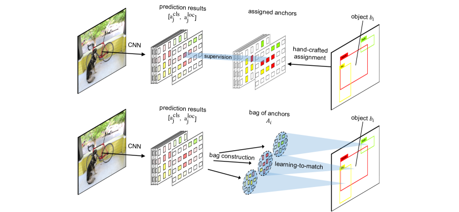

## FreeAnchor

The Code for "FreeAnchor: Learning to Match Anchors for Visual Object Detection". \[[https://arxiv.org/abs/1909.02466](https://arxiv.org/abs/1909.02466)\]



Detection performance on COCO:

| Hardware | Backbone | Iteration | Scale jittering<br>train / test | AP<br>(minival) | AP<br>(test-dev) | model link |
| :--------: | :--------------------: | :---: | :-------: | :--: | :--: | :------------------------: |
| 4  x  V100 | ResNet-50-FPN          |   90k |   N / N   | 38.6 | 39.1 | [Google Drive](https://drive.google.com/file/d/1EH-NlADMrnf-VT3gCQNyN7DMJOgPDxXD/view?usp=sharing)                       <br>[Baidu Drive](https://pan.baidu.com/s/1ST2nv4s48voofWqwUUwHhw#/)                                                                        |
| 4  x  V100 | ResNet-101-FPN         |   90k |   N / N   | 41.0 | 41.3 | [Google Drive](https://drive.google.com/file/d/1ykjXoLk-tnY7hOu6VlQsJ57AOBO42LPT/view?usp=sharing)                  <br>[Baidu Drive](https://pan.baidu.com/s/1Lfg1Wt0Et60QSP1pU3iLRQ#/)                                                                        |
| 4  x  V100 | ResNet-101-FPN         |  135k |   N / N   | 41.3 | 41.8 | [Google Drive](https://drive.google.com/file/d/1RtBMzjhrOegCmhUSpI-ndbjjJrrsihB2/view?usp=sharing)                  <br>[Baidu Drive](https://pan.baidu.com/s/1ekr8thnlPmPqxGVjGaUQZg#/)                                                                        |
| 4  x  V100 | ResNeXt-101-32x8d-FPN  |  135k |   Y / N   | 44.2 | 44.8 | [Google Drive](https://drive.google.com/file/d/1RFQuA-6_h4Cb8Np8cjvBEbKlqcH7w5mk/view?usp=sharing)                          <br>[Baidu Drive](https://pan.baidu.com/s/14UpeLSL8SNVZZUnsVKMnDQ#/)                                                                        |

| Hardware | Backbone | Iteration | Scale jittering<br>train / test | AP<br>(minival) | AP<br>(test-dev) | model link |
| :--------: | :--------------------: | :---: | :-------: | :--: | :--: | :------------------------: |
| 8 x 2080Ti | ResNet-50-FPN          |   90k |   N / N   | 38.4 | 38.9 | [Google Drive](https://drive.google.com/file/d/1YZ63xD4f-8d4Ozcz1H8rCTePIK2fXeea/view?usp=sharing)                  <br>[Baidu Drive](https://pan.baidu.com/s/1p2hnZPPJvtHCgntUZe2SvA#/)                                                                        |
| 8 x 2080Ti | ResNet-101-FPN         |   90k |   N / N   | 40.4 | 41.1 | [Google Drive](https://drive.google.com/file/d/1zeGRYhMAgSVWC9ARGvXdVF0U5KSE8WMQ/view?usp=sharing)                  <br>[Baidu Drive](https://pan.baidu.com/s/1Tz5-flBPLenV9T9vkQIhBg#/)                                                                                |
| 8 x 2080Ti | ResNet-101-FPN         |  135k |   N / N   | 41.1 | 41.5 | [Google Drive](https://drive.google.com/file/d/1al9itwiPXX8lVU1uFvzXL7BnBw9hBDnI/view?usp=sharing)                  <br>[Baidu Drive](https://pan.baidu.com/s/1efjzVT0y1HDUAUEaaZ8YLg#/)                                                                        |
| 8 x 2080Ti | ResNeXt-101-32x8d-FPN  |  135k |   Y / N   | 44.2 | 44.9 | [Google Drive](https://drive.google.com/file/d/1vZuV4uSDR6t1Va_8E-iS9Ht7PutC_JDd/view?usp=sharing)                  <br>[Baidu Drive](https://pan.baidu.com/s/18NHsQb-ZBRS4Xcfxfmsuyw#/)                                                                                   |

| Hardware | Backbone | Iteration | Scale jittering<br>train / test | AP<br>(minival) | AP<br>(test-dev) | model link |
| :--------: | :--------------------: | :---: | :-------: | :--: | :--: | :------------------------: |
| 8 x 2080Ti | ResNet-101-FPN         |  180k |   Y / N   | 42.7 | 43.1 | [Google Drive](https://drive.google.com/file/d/1XxOGpE5-OX5mW5fee1jxXxFhO4vmo3fk/view?usp=sharing)                  <br>[Baidu Drive](https://pan.baidu.com/s/1SGmGwu7TnfR9oyVJVxxC2g#/)                                                                                   |


## Installation 
Check [INSTALL.md](INSTALL.md) for installation instructions.

## Usage
You will need to download the COCO dataset and configure your own paths to the datasets.

For that, all you need to do is to modify `maskrcnn_benchmark/config/paths_catalog.py` to point to the location where your dataset is stored.

#### Config Files
We provide four configuration files in the configs directory.

| Backbone | Iteration | Scale jittering<br>train / test | Config File |  
| :-----: | :---: | :---: | :----------: |
| ResNet-50-FPN    |   90k |   N / N  | configs/free_anchor_R-50-FPN_1x.yaml      | 
| ResNet-101-FPN   |   90k |   N / N  | configs/free_anchor_R-101-FPN_1x.yaml     | 
| ResNet-101-FPN   |  135k |   N / N  | configs/free_anchor_R-101-FPN_1.5x.yaml   | 
| ResNeXt-101-32x8d-FPN  |  135k |   Y / N  | configs/free_anchor_X-101-FPN_j1.5x.yaml  | 


#### Training with 4 GPUs (4 images per GPU)

```bash
cd path_to_free_anchor
export NGPUS=4
python -m torch.distributed.launch --nproc_per_node=$NGPUS tools/train_net.py --config-file "path/to/config/file.yaml"
```

#### Training with 8 GPUs (2 images per GPU)

```bash
cd path_to_free_anchor
export NGPUS=8
python -m torch.distributed.launch --nproc_per_node=$NGPUS tools/train_net.py --config-file "path/to/config/file.yaml"
```

#### Test on MS-COCO test-dev

```bash
cd path_to_free_anchor
python -m torch.distributed.launch --nproc_per_node=$NGPUS tools/test_net.py --config-file "path/to/config/file.yaml" MODEL.WEIGHT "path/to/.pth file" DATASETS.TEST "('coco_test-dev',)"
```

#### Evaluate NMS Recall

```bash
cd path_to_free_anchor
python  -m torch.distributed.launch --nproc_per_node=$NGPUS tools/eval_NR.py --config-file "path/to/config/file.yaml" MODEL.WEIGHT "path/to/.pth file"
```
## Citations
Please consider citing our paper in your publications if the project helps your research.
```
@inproceedings{zhang2019freeanchor,
  title   =  {{FreeAnchor}: Learning to Match Anchors for Visual Object Detection},
  author  =  {Zhang, Xiaosong and Wan, Fang and Liu, Chang and Ji, Rongrong and Ye, Qixiang},
  booktitle =  {Neural Information Processing Systems},
  year    =  {2019}
}
```
